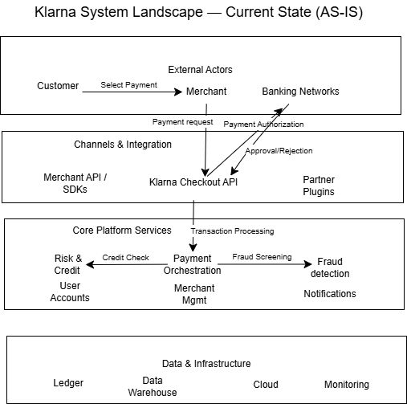
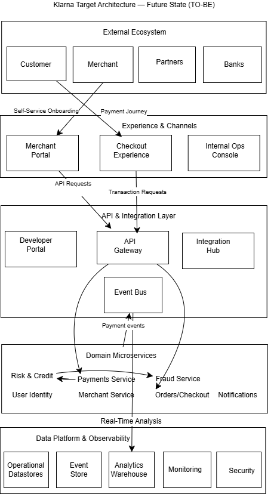

# Klarna Digital Strategy & System Architecture Case

## Disclaimer

This case study is based on publicly available information and independent strategic analysis. It does not represent Klarna’s internal systems or actual architecture.

---

## 1. Introduction

This case explores how Klarna can evolve its digital strategy and system architecture to support global expansion, faster merchant onboarding, and scalable payment innovation.

---

## 2. Problem Statement

Klarna aims to scale its global merchant network and launch new payment capabilities faster. However, increasing transaction volumes, localized payment requirements, and integration complexity create challenges in scalability, flexibility, and operational efficiency.

This case analyzes Klarna’s current platform setup and proposes a future-state architecture and digital strategy to enable sustainable growth.

---

## 3. Current State Analysis (AS-IS)

This section analyzes Klarna’s existing business model, payment platform structure, and system integration landscape.

**Areas covered:**

* Business model overview
* Merchant onboarding process
* Payment processing landscape
* System integration model
* Identified pain points

---

### 3.1 Business Model Overview

Klarna operates as a global fintech platform providing digital payment solutions for both consumers and merchants. Its core offering enables flexible payment options such as Buy Now, Pay Later (BNPL), installment payments, and direct checkout services.

The platform acts as an intermediary between consumers, merchants, and financial institutions, facilitating transactions while managing credit risk and payment processing.

Revenue streams include:

* Merchant transaction fees
* Consumer financing fees
* Interest from installment payments
* Value-added merchant services

Klarna’s business growth depends heavily on expanding its global merchant network and increasing transaction volume across markets.

---

### 3.2 Merchant Onboarding Process

Merchant onboarding is the process through which businesses integrate Klarna’s payment solutions into their checkout environments.

The onboarding journey typically includes several stages:

1. Merchant registration and business verification
2. Contractual agreements and compliance checks
3. Technical integration via APIs or platform plugins
4. Payment method configuration
5. Testing and go-live deployment

Klarna supports integrations through multiple channels, including direct API connections, e-commerce platform plugins, and partner integrations.

However, onboarding complexity can vary depending on merchant size, technical maturity, and geographic market requirements.

#### Observed challenges:

* Integration timelines can be lengthy for custom implementations
* Compliance requirements differ across markets
* Technical documentation may require specialized developer support
* Limited self-service onboarding for smaller merchants

---

### 3.3 Payment Processing Landscape

Klarna’s payment processing platform manages end-to-end transaction flows between consumers, merchants, and financial institutions.

When a customer selects Klarna at checkout, the platform performs multiple real-time operations:

1. Payment authorization request
2. Credit risk assessment
3. Fraud detection screening
4. Transaction approval or rejection
5. Payment settlement and fund transfer

These processes must operate with high availability and low latency to ensure a seamless checkout experience.

The payment platform interacts with several internal and external systems, including:

* Risk and credit scoring engines
* Fraud detection services
* Banking networks and payment processors
* Consumer account services
* Merchant transaction ledgers

#### Observed challenges:

* High transaction volumes during peak periods strain system performance
* Real-time risk processing introduces latency risks
* Fraud detection requires continuous model updates
* Settlement processes vary across regions and banking partners

These structural and operational challenges form the foundation for the future-state digital strategy and system architecture proposed in the following sections.

---

### AS-IS Payment Flow Diagram

  
   
  <em>Figure 1: Klarna Payment Flow – Current State (AS-IS)</em>

---

### System Landscape — Current State (AS-IS)

  
   
  <em>Figure 2: Klarna System Landscape — Current State (AS-IS)</em>

---

## 4. Future State Strategy (TO-BE)

### Target Architecture — Future State (TO-BE)

  
   
  <em>Figure 3: Klarna Target Architecture — Future State (TO-BE)</em>

This section defines the strategic vision for Klarna’s digital platform transformation.

**Focus areas:**

* Digital platform vision
* Modular ecosystem strategy
* API-first transformation
* Innovation enablement

---

## 5. System Architecture Design

This section presents the proposed target system architecture required to support the future-state strategy.

**Key components:**

* Target architecture principles
* Microservices architecture model
* Integration layer design
* Data & infrastructure architecture

---

## 6. Business Impact Assessment

This section evaluates the business value generated by the proposed transformation.

**Impact dimensions:**

* Operational efficiency gains
* Revenue enablement
* Risk reduction
* Scalability improvements

---

## 7. Implementation Roadmap

This section outlines how Klarna could realistically execute the transformation.

**Key elements:**

* Transformation phases
* Capability rollout plan
* Dependencies & risks

---

## 8. Strategic Conclusions

This section summarizes the strategic outcomes of the case.

**Includes:**

* Key recommendations
* Long-term platform positioning
* Competitive advantage implications

---

## 9. Executive Summary

This case explores how Klarna can evolve its digital strategy and system architecture to support global scalability, faster merchant onboarding, and continuous payment innovation.

The current platform faces challenges related to integration complexity, increasing transaction volumes, and the need for localized payment solutions. These limitations impact scalability, operational efficiency, and time-to-market for new features.

To address these challenges, a future-state architecture is proposed based on four key principles:

- API-first platform enabling self-service integrations  
- Domain-based microservices for scalability and faster development  
- Event-driven architecture supporting real-time data and decoupled systems  
- Integrated data and observability layer for monitoring and decision-making  

The proposed transformation enables significant business value, including:

- Faster merchant onboarding and reduced operational costs  
- Increased revenue through faster product launches and global expansion  
- Improved risk management and fraud detection capabilities  
- Enhanced system performance and scalability  
- Better customer and merchant experience  

A phased implementation roadmap ensures a controlled and realistic transition from the current state to the target architecture, minimizing risk while continuously delivering value.

Overall, this transformation positions Klarna as a scalable, data-driven, and innovation-focused fintech platform capable of sustaining long-term competitive advantage.

